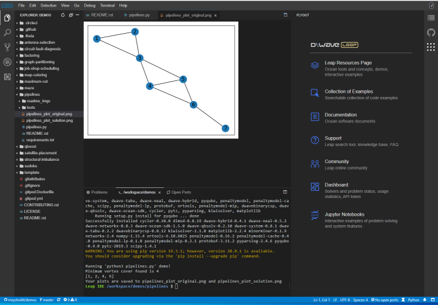

========
Leap IDE
========

An Integrated Development Environment(IDE) for quantum applications hosted in
`Leap quantum applications environment <https://cloud.dwavesys.com/leap>`_.

  A view of the IDE.

The Leap IDE default workspace is a development environment pre-configured with
Ocean software and some typically used libraries such as Matplotlib. It also
includes D-Wave extensions such as the problem inspector and a navigation
flyout menu. Your SAPI API token is set as an environment variable.

Creating a Workspace from Scratch
---------------------------------

The recommended workflow for new application development is to start from a template
or example workspace and modify it. If you prefer to create your workspace from scratch,
consider including some or all of the defaults:

* Docker file: <where is this downloaded from and tag>
* Leap token: <command to set token as env variable
* Extensions: problem inspector, navigation flyout panel, searchable examples
